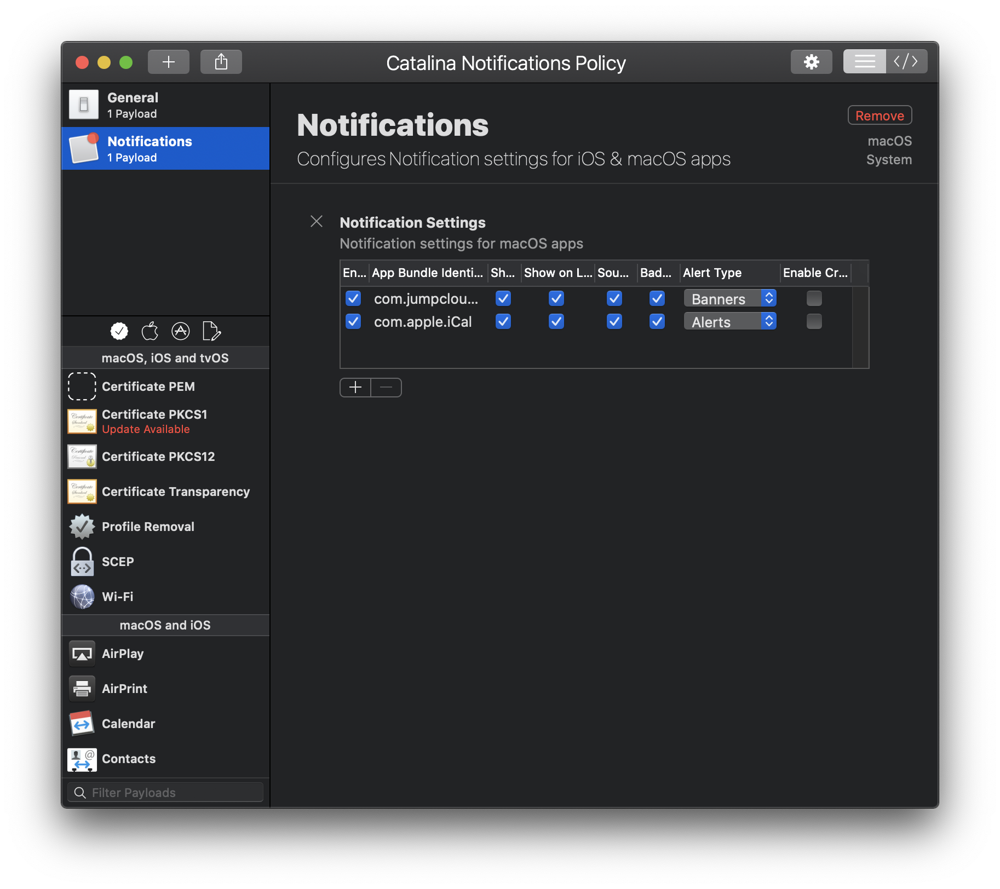
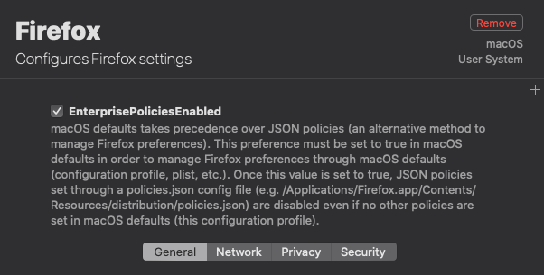
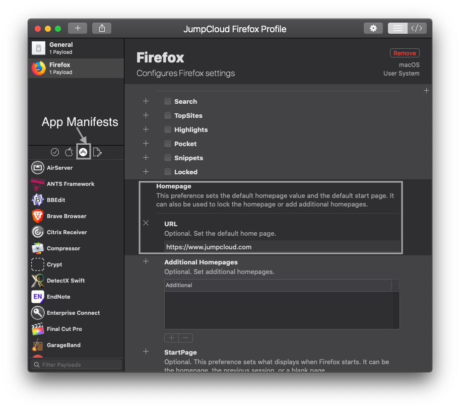
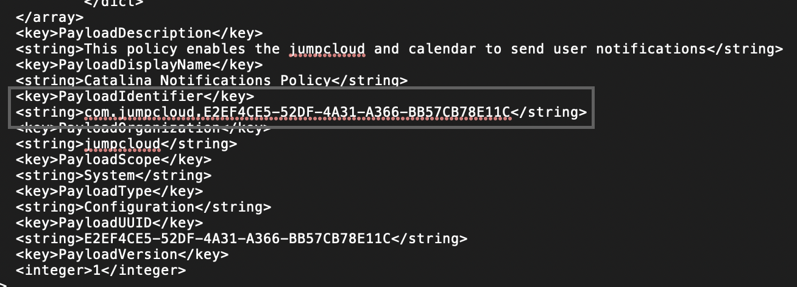
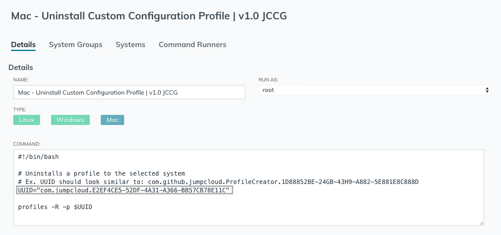

# Custom Configuration Profiles in JumpCloud

JumpCloud supports the management of custom configuration [profiles](https://developer.apple.com/documentation/devicemanagement/using_configuration_profiles?language=objc) through [JumpCloud commands](https://support.jumpcloud.com/support/s/article/getting-started-commands-2019-08-21-10-36-47). Tools like [ProfileCreator](https://github.com/ProfileCreator/ProfileCreator) or [Apple Configurator 2](https://apps.apple.com/us/app/apple-configurator-2/id1037126344?mt=12) can be used to generate .mobileconfig files which contain preferences for systems and macOS applications. Profiles generated with ProfileCreator or other methods can be distributed to JumpCloud systems using the macOS binary `profiles` application and JumpCloud commands. Since the .mobileconfig files are almost undoubtably under the [1MB payload limit](https://support.jumpcloud.com/support/s/article/getting-started-commands-2019-08-21-10-36-47#Files) of a JumpCloud command, those files can up uploaded and distributed using JumpCloud commands.

## Table of Contents

- [Custom Configuration Profiles in JumpCloud](#custom-configuration-profiles-in-jumpcloud)
  - [Table of Contents](#table-of-contents)
  - [General settings for ProfileCreator](#general-settings-for-profilecreator)
  - [Command Examples](#command-examples)
    - [Catalina Notifications Profile](#catalina-notifications-profile)
    - [Firefox Custom Profile](#firefox-custom-profile)
    - [Custom Dock Profile](#custom-dock-profile)
    - [Custom Font Distribution](#custom-font-distribution)
    - [Disable Airdrop](#disable-airdrop)
  - [Export a profile](#export-a-profile)
  - [Import the "JumpCloud Install Custom Configuration Profile" Command](#import-the-%22jumpcloud-install-custom-configuration-profile%22-command)
  - [Other Considerations](#other-considerations)
    - [Password protected profiles](#password-protected-profiles)
    - [Signing Profiles](#signing-profiles)
    - [Caveats, MDM restrictions](#caveats-mdm-restrictions)
    - [Removal of profiles](#removal-of-profiles)
  
## General settings for ProfileCreator

The ProfileCreator application has a well-documented [wiki](https://github.com/ProfileCreator/ProfileCreator/wiki). Consult the wiki for ProfileCreator specific issues or join the conversion over in the #profilecreator channel in the [MacAdmins Slack](https://www.macadmins.org/) for additional help.

When opening ProfileCreator for the first time, it's advised to set organizational identifiers. Profiles exported with ProfileCreator are identified with the organizational identifiers set under ProfileCreator > Preferences > Profile Defaults:


Consider setting an organization name and identifier. Optionally, [sign each profile](#signing-profiles).

## Command Examples

The following section will walk through several example custom configuration profiles. At the time of this writing development of ProfileCreator manifests were still in development although the application ProfileCreator is no longer in development. The following examples should be used as a reference and tested in an environment prior to deployment

- Catalina Notifications
- Firefox Settings
- Custom Dock Configuration
- Custom Font Distribution

### Catalina Notifications Profile

This example demonstrates the work required to build a custom policy to allow notifications on several applications. As of the release of macOS Catalina 10.15 users are prompted to allow or deny specific applications from prompting notification banners.

This profile will allow the JumpCloud tray application to send the user notifications.

To create a new profile, open ProfileCreator and click the [ + ] icon.


Select a name for the policy, add a description and change the organization name if the settings were not applied by default. Depending on the policy scope, a profile can be applied at the System or User level. In this example the notification payload is a System level payload.


Scroll down the left column profile template window, under macOS select the Notifications Payload, add the payload and add the notification settings preference so that the window is editable like the example below. Profiles selected as part of the profile payload are listed in top left column under the General tab.


In order to add applications to the payload the "App Bundle Identifier" name is required. There are several methods for identifying an applications "App Bundle Identifier". A quick way to identify an given "App Bundle Identifier" is to run the following command, substituting "Microsoft Excel" for the name of an application as it exists in a systems /Applications window.

```bash
osascript -e 'id of app "Microsoft Excel"'
```


The result of that command run against the JumpCloud application is: `com.jumpcloud.jcagent-tray`. Copy that value into the "App Bundle Identifier" for the Notification payload preference. In the example image below the `com.apple.iCal` notification settings are also applied. Note the difference between "Alert Types" between the two preferences. Refer to Apple's documentation on [alert types](https://developer.apple.com/design/human-interface-guidelines/macos/system-capabilities/notifications/) for more information.



Save and [Export](#export-a-profile) the profile for deployment. Distribute to JumpCloud systems by [importing the custom configuration profile](#import-the-%22jumpcloud-install-custom-configuration-profile%22-command) command
### Firefox Custom Profile

Firefox or other browsers can be configured to accept settings from a profile. To create an application manifest payload. Select the application icon and add the Firefox profile. Ensure the EnterprisePoliciesEnabled checkbox is ticked like the example below:



Add a setting like default homepage like the example below. Save and [export the policy](#export-a-profile).



Save and [Export](#export-a-profile) the profile for deployment. Distribute to JumpCloud systems by [importing the custom configuration profile](#import-the-%22jumpcloud-install-custom-configuration-profile%22-command) command

### Custom Dock Profile

An admin can configure a custom dock payload for their systems using ProfileCreator. The example payload below demonstrates a configuration to add Chess, Calendar and Terminal to the users dock. (Note. This configuration will only work with Catalina systems since only Catalina OS has system applications Stored under the `/System/Applications/` path)

This example sets the dock pixel size to 24px and positions the dock on the left side of the screen.


Save and [Export](#export-a-profile) the profile for deployment. Distribute to JumpCloud systems by [importing the custom configuration profile](#import-the-%22jumpcloud-install-custom-configuration-profile%22-command) command

### Custom Font Distribution

Individual Fonts or Font Families can be distributed through custom profiles. The Payload example below contains four Font Payloads. Clicking the [+] icon next to payload allows a user to add additional payloads to the profile. In the example below, [Google's Roboto Mono for Powerline](https://github.com/powerline/fonts/tree/master/RobotoMono) font is being distributed along with the Bold, Medium and Light font variants in the other payloads.


(note: Font payloads must be under 1MB to comply with the JumpCloud command file size limit)

Save and [Export](#export-a-profile) the profile for deployment. Distribute to JumpCloud systems by [importing the custom configuration profile](#import-the-%22jumpcloud-install-custom-configuration-profile%22-command) command

### Disable Airdrop

A profile to disable AirDrop can be distributed as a custom profile. The Payload example below contains a single Payload to disable AirDrop. Click the Apple Icon and add the AirDrop (macOS) Payload to a profile. Click the Disable AirDrop checkbox to ensure AirDrop is disabled on systems with this profile. Systems must be restarted for the profile to apply.


Save and [Export](#export-a-profile) the profile for deployment. Distribute to JumpCloud systems by [importing the custom configuration profile](#import-the-%22jumpcloud-install-custom-configuration-profile%22-command) command


## Export a profile

Assuming a profile is ready for deployment. Save and Export the profile using the ProfileCreator file menu. File > Export...

On the export menu, choose a location to save the profile. The profile will be uploaded to a JumpCloud command. Optionally, [sign the profile](#signing-profiles) with an Apple Developer certificate.


## Import the "JumpCloud Install Custom Configuration Profile" Command

Using the PowerShell module, import the [Install Custom Configuration Profile](Mac&#32;-&#32;Install&#32;Custom&#32;Configuration&#32;Profile.md) command to a JumpCloud tenant.

```pwsh
Import-JCCommand -URL 'https://git.io/JedCp'
```

Open the newly imported JumpCloud command within the JumpCloud Console. Under "Files" select the "Upload Files" button and upload the .mobileconfig profile created with ProfileCreator. Copy the .mobileconfig name to the "profile" variable within the command text block like the example below:


Optionally, rename the command to help identify which profile is installed. If desired, the install script could be modified to install multiple profiles. Each profile would need to be uploaded to the command and each profile would need to be installed explicitly and separately like the example commands below:

```bash
/usr/bin/profiles -I -F "/tmp/Catalina Notification Profile.mobileconfig"
/usr/bin/profiles -I -F "/tmp/JumpCloud Firefox Profile.mobileconfig"
```

## Other Considerations

### Password protected profiles

Profiles can be password protected with profile specific password. If a profile is password protected, it would require admin credentials and knowledge of the profile's password in order to remove the profile from a system. Profile Removal passwords are stored in clear text. Profiles should be encrypted before distribution. Apple's [documentation on the matter is informative](https://developer.apple.com/documentation/devicemanagement/using_configuration_profiles), [Rich Trouton's post on encrypted profiles](https://derflounder.wordpress.com/2019/09/16/creating-macos-configuration-profiles-with-encrypted-payloads/) provides instructions for profile encryption.

### Signing Profiles

Signed policies appear as "Verified" on system endpoints, signing a profile requires access to an [Apple Developer Account](https://developer.apple.com/). Policies signed with an Apple Developer account are verified on system endpoints. Signing ensures the profiles is not modified in transit.


### Caveats, MDM restrictions

Some profiles must be distributed though at least User Approved MDM. Without User Approved MDM, JumpCloud does not currently support distribution of the following profiles:

- Privacy Preference Policy Control Profiles
- Google Account Profiles

Distributing custom profiles requires some knowledge of the existing profiles within an organization. Profiles in JumpCloud may alter the same preferences as custom profiles. Setting a custom password policy profile will conflict with settings in JumpCloud for example. It's of utmost importance to test policy deployments before organization wide distribution.

### Removal of profiles

Profiles generated with ProfileCreator (and other methods) are identified with a unique profileIdentifier. The `profiles` binary on macOS is leveraged to remove profiles by profileIdentifier.

Right-clicking an unencrypted .mobileconfig file should yield an xml file with a number of key value pairs. The image below displays a sample profileIdentifier for a custom profile. Copy the profile profileIdentifier to the clipboard.



The xml key value pair should look something like this:

```xml
<key>PayloadIdentifier</key>
<string>com.jumpcloud.KBL9OML3L-JD93-3K2L-39ID-KKEP34JK34KL4</string>
```

To identify a profile already installed on a macOS system, run the `sudo profiles -P` command to view all profiles currently installed on a system. the profileIdentifier attribute for each profile should be available.


To remove a profile from a system, import the [uninstall command](Mac&#32;-&#32;Uninstall&#32;Custom&#32;Configuration&#32;Profile.md) with PowerShell and copy the profileIdentifier of the profile which is scheduled to be removed from a system. Assign that value to the UUID variable of the uninstall command and run against a set of systems.


